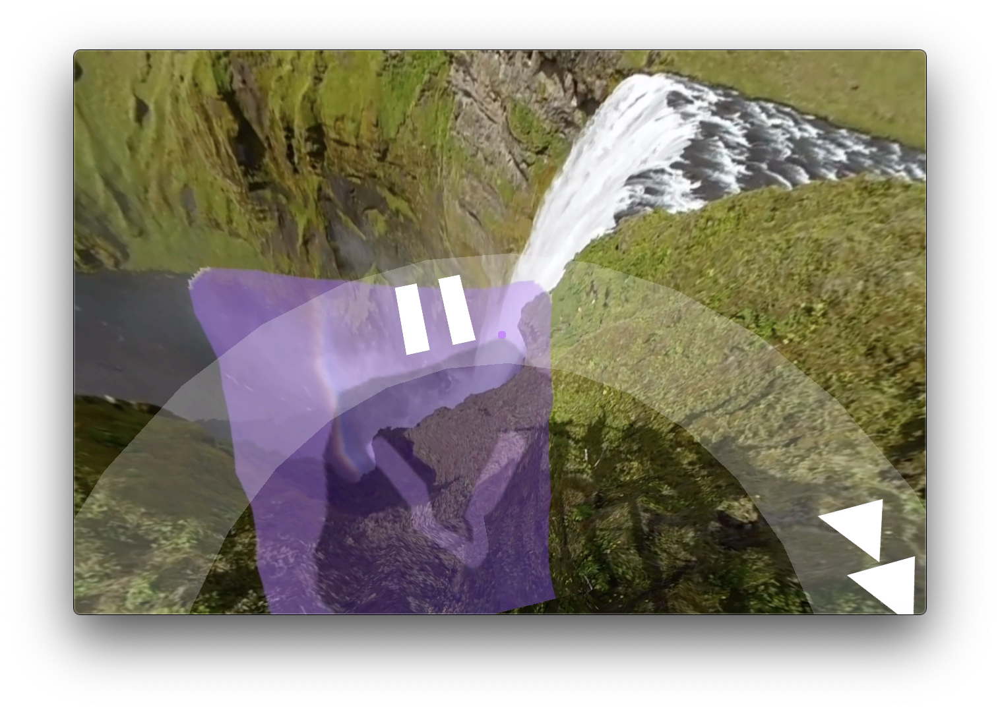
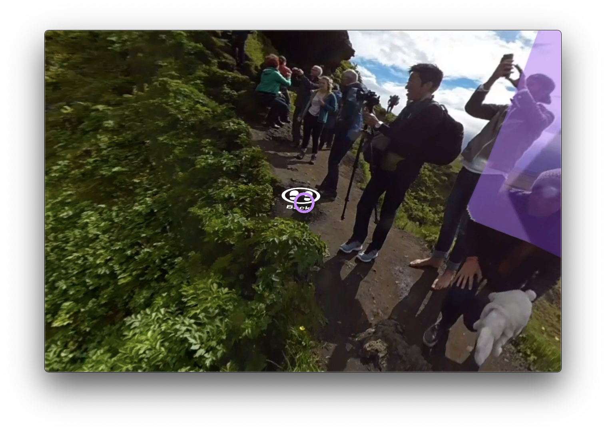
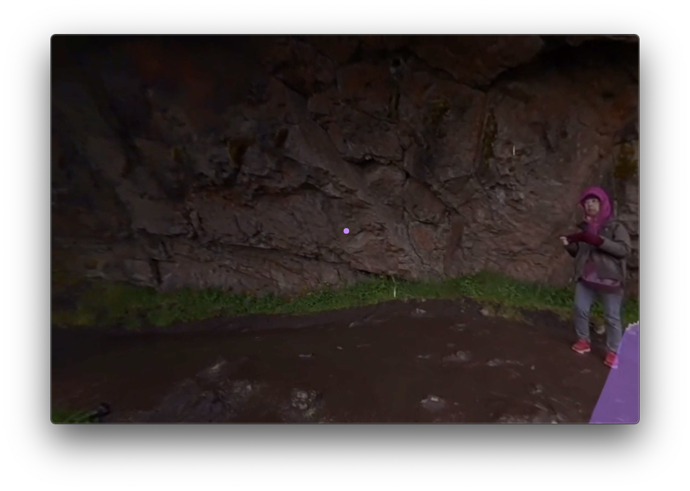

# VR Developer Nanodegree Program
## Term 3 Project 2: The Storyteller’s Revenge
##### By Joshua Newnham

This project uses a 360 video to take the user on a tour through a waterfall in Iceland. The user starts their journey at the top of the waterfall then proceed to make their way down until they find themselves under the waterfall.  

The project took approximitely 3 weeks part-time with the majority of the effort in editing the video. The one thing I liked was also the most challenging which was devising how to tell a story in VR and how to make it interactive; whilst dynamic content would allow for more flexibility and more immersive interaction I found the the static content pose a interesting creative challenge - admittely it was also limited to the available content accessible to myself.  

In this document I highlight the main interactive components required for the project. 

### Video control 
Video control was accessiable via a circular menu positioned on the floor; the reason for it's position was to ensure it did not obstruct the user but also easily and quickly accessiable.

### Story branch  
The narrative is complemented with a narrator which notifies the user when they need to make a decision. In this project there is only one where the user is given the choice of returning to the top or proceeding down the path. 

### Particle effect  
A particle system to create splatters of 'water' is started once the user gets to the end of their journey (when they are closest to the waterfall). It's use is to add a subtle effect, complementing the video and context.  

